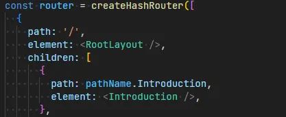
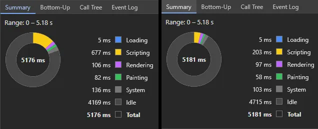
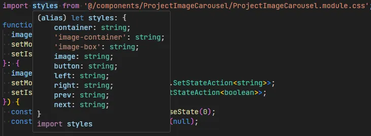
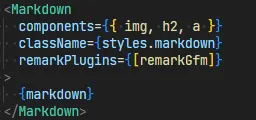
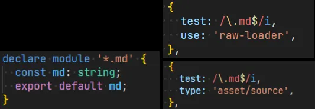
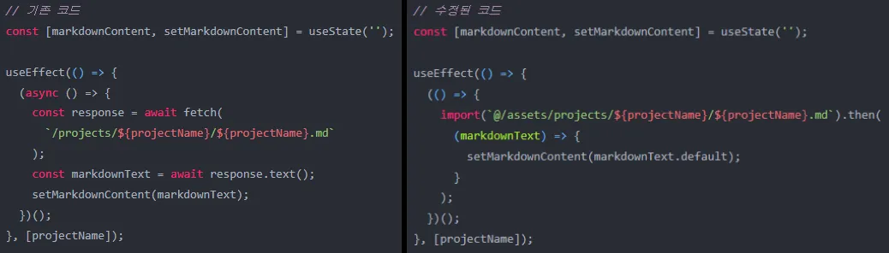

## 프로젝트 개요

**심재원**의 프론트엔드 포트폴리오 사이트입니다.
cra, vite와 같은 툴 없이 webpack과 babel을 직접 설정하여 react, typescript 개발환경을 구축했습니다.

백엔드 서버 없이 github page로 배포한 정적 웹페이지입니다.

## 개발 환경

- node v16.18.0, npm, webpack, babel, typescript, react, react-router-dom, eslint, prettier, css-module, react-markdown

## 배포 방식

main에 merge하면 build가 되어 배포도록 한다.

## 주요 기능

- 스팀 스타일로 꾸민 **포트폴리오** 사이트
- 대부분의 사진에 **modal** 기능 지원
- carousel을 통해 **프로젝트 스크린샷** 확인 가능
- markdown 파일을 **html로 변환**하여 손쉬운 프로젝트 추가

## 프로젝트 성과

vite나 CRA 없이 webpack으로 직접 번들링 수행  
scroll animation, carousel, modal을 **라이브러리 없이** 직접 구현  
**동적 import**를 사용해 이미지를 유동적인 이미지 삽입

## 스택 선정 이유

- React: 가장 많이 사용되는 라이브러리이므로 **더 깊게 활용**해보기 위함
- TypeScript: **손쉬운 디버깅**을 통해 버그를 사전에 방지와 **IDE 자동 리스트업 기능**을 사용하기 위함
- webpack: webpack과 babel에 대해 **공부**하며 **직접 번들링** 설정을 해보기 위함
- css-module: 클래스명이 **중복**되는 경우를 **방지**하기 위함
- React-markdown: 프로젝트 상세내용 작성시 **markdown 형식**으로 편리하게 작성하기 위함

## 작업 기여도
1. webpack 및 babel 설정을 통한 개발 환경구성  
    - vite, cra와 같은 도구 없이 직접 설정
2. scroll animation, carousel, modal 등 직접 구현
    - 개발 역량 향상을 위해 직접 구현
3. 아토믹한 컴포넌트 구성
    - 자주 사용하는 컴포넌트는 재활용성을 생각해 아토믹하게 구현
4. markdown을 사용해 프로젝트 상세 내용 작성하는 기능 구현
    - 프로젝트 내용 작성의 용이함을 위해 markdown을 html로 변환하는 기능 구현

## 프로젝트 리뷰

- webpack을 처음부터 구현하는 과정을 통해 **webpack과 babel**에 대해 공부할 수 있었습니다.
- scroll animation을 구현하면서 다양한 방법을 시도한 경험에서 **최적화**에 대해 고민할 수 있었습니다.
- 한 번 만들어놓은 modal을 여러번 재사용하며, **컴포넌트 재사용과 확장성**의 중요성에 대해 배웠습니다.
- **dynamic import**에 대해 공부하며 이미지에 동적으로 접근하는 방법이 public 뿐만이 아니란 것을 알게되었습니다.
- 그동안 익혔던 기술과 처음 알게된 다양한 기술을 사용해보며 **실력을 향상**할 수 있었던 기회였습니다.

## 관련 링크

[github](https://github.com/appletail/appletail.github.io)  
[figma](https://www.figma.com/design/pqs7iZHYm1cGZIjhnl5LHR/Untitled?node-id=275-44&t=vbkHz9K5jmGHJOTP-1)

## 트러블 슈팅

### 1. HashRouter

  
**[문제점]** 배포사이트에서 새로고침시 404페이지로 이동하는 오류가 발생했습니다.

**[해결]** CSR의 특성으로 인해 발생하는 것이었습니다.

- 새로고침시 react-router가 실행되지 않을것이므로 브라우저는 서버에 요청을 보내게됩니다.
- 하지만 제 프로젝트는 서버가 없기때문에 404에러가 발생합니다.

그래서 **HashRouter**를 사용했습니다. HashRouter를 사용한 이유는 다음과 같습니다.

- 개인적인 포트폴리오 사이트이기 때문에 SEO를 고려할 필요가 없다.
- 약간의 [트릭](https://create-react-app.dev/docs/deployment/#notes-on-client-side-routing)을 사용하는 수고를 하기보다는 HashRouter를 사용하는 것이 시간적으로 이득이다.

### 2. scroll animation 최적화

  
**[문제점]** scroll animation을 구현한 결과 Scripting 시간이 길어지는 문제가 발생했습니다.

**[해결]** 문제의 원인을 찾기 위해 animation hook이 실행되는 횟수를 추적했습니다.  
그 결과, 스크롤 한 번에 100번이 넘게 실행되는 것을 확인할 수 있었습니다.

기존의 방법은 **세로 스크롤의 위치를 useState에 저장**하는 방식이었기 때문에 이러한 문제가 발생하는 것이라고 판단했습니다.  
이를 해결하기 위해 스크롤 위치를 확인하는게 아닌 타겟 요소를 추적하는 **IntersectionObserver API**를 사용했습니다.

### 3. css-module ide 인식

  
**[문제점]** css-module을 사용하며 IDE 자동 리스트업 기능이 없어 불편했습니다.

**[해결]** css-module은 객체 형식으로 import되는만큼 리스트업이 가능할 것이라 생각하고 관련 라이브러리를 찾아봤습니다.  
**typescript-plugin-css-modules** 라이브러리를 찾을 수 있었고, 공식문서에 따라 설치했습니다.  
거인의 어깨 위에서 개발한다는 느낌을 받을 수 있었습니다.

### 4. react-markdown

  
**[문제점]** 포트폴리오 상세 내용을 작성할 때 html 형식으로 작성하기에는 복잡했습니다. 그래서 편리하게 작성할 방법이 필요했습니다.

**[해결]** 저는 옵시디언을 사용하여 **markdown 작성 방식**에 익숙했기 때문에 이를 활용하는 방법을 찾아봤습니다.  
과거 수행했던 프로젝트 중 **노가리** 프로젝트에서 markdown을 html로 변환하는 기능이 있었습니다.  
이와 비슷한 라이브러리가 있는지 탐색했고, **react-markdown**을 찾았습니다.  
공식문서를 보며 변환된 html을 제가 원하는 모양으로 꾸며 프로젝트에 적용했습니다.

### 5. markdown 인식

  
**[문제점]** markdown 파일을 import하면 에러가 발생하는 문제가 있었습니다.

**[해결]** typescript에서 타입이 정의되지 않아 발생하는 문제라고 판단했습니다.

- 이미지 파일과 같은 방식으로 **타입을 정의**했습니다.

하지만 **webpack** 번들링 과정에서도 에러가 발생했습니다.

- 먼저, 공식문서를 통해 react-markdown에 markdown이 **입력되는 방식**을 확인했습니다.
- **문자열 방식**으로 입력되는 것을 확인한 후 webpack의 plugin 중 파일을 문자열로 번들링할 수 있는지 확인했습니다.
- **raw-loader**를 사용하면 문자열로 가져올 수 있다는 것을 알게되었고, 이를 사용해 문제를 해결했습니다.

추후 raw-loader는 **DEPRECATED**되었고 **Asset Modules**로 통합되었다는 것을 알게되었습니다.

- 공식문서의 [Source assets](https://webpack.js.org/guides/asset-modules/#source-assets)을 보며 raw-loader를 Asset Modules로 **migration**했습니다.

### 6. [dynamic import](https://appletail.tistory.com/142)

  
**[문제점]** public을 사용하는 동적 import 방식이 배포사이트에서 동작하지 않았습니다.

**[해결]** public과 달리 **src 폴더**에 있는 번들링된 이미지 경로는 잘 찾았기 때문에 이를 활용할 방법을 탐색했습니다.  
탐색 결과, **import()** 에 대해 알게되었습니다. 동적인 import 방식인데 구조가 간단하고 고정되어있을 때에만 사용할 수 있는 코드입니다.  
제 코드는 단순했기 때문에 충분히 사용할 수 있을 것이라고 판단하여 적용했고, 문제를 해결했습니다.

---

### ※ 공식문서 외 참고 사이트

#### 환경구축

https://velog.io/@jungsangu/Webpack-Babel로-React-Typescript-개발환경-구축하기  
https://typescript-kr.github.io/pages/tutorials/react-&-webpack.html  
https://velog.io/@party3205/React-Cra-없이-리액트-직접-구현하며-웹팩-바벨-다루기  
https://velog.io/@han1368/ReactTypescriptEsLintairbnbPrettier-개발환경-설정-방법  
https://blog.shiren.dev/2020-12-01/

#### 배포

https://velog.io/@kdeun1/Github-Actions로-gh-pages-자동-배포하기  
https://torbjorn.tistory.com/807
