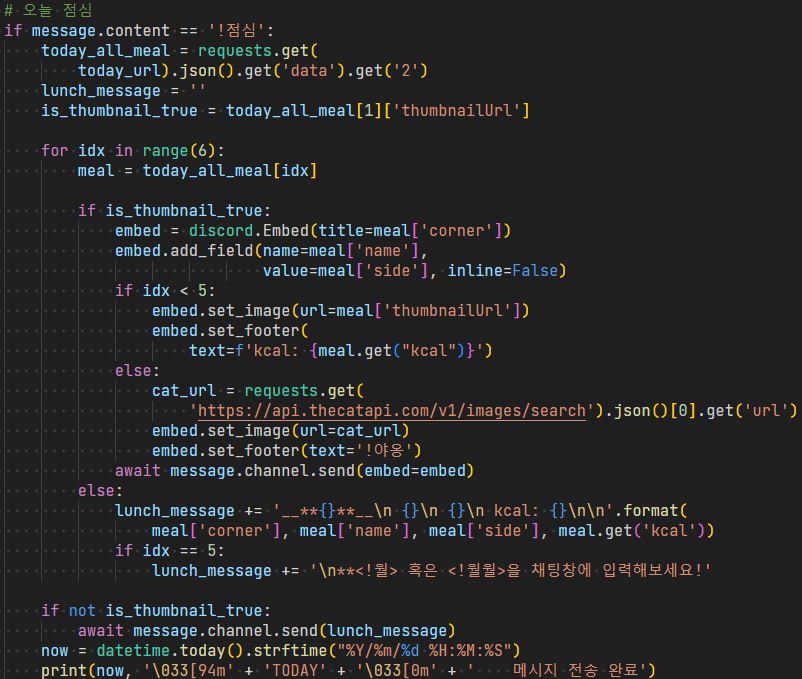
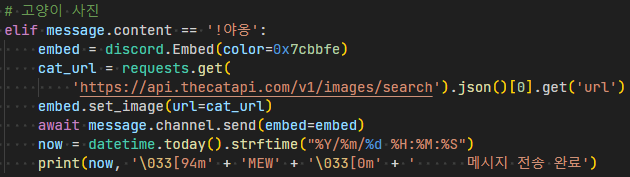

## 주요 기능

- 프레시밀 앱을 사용하지 않고 **디스코드**에서 식단표 확인
- 식단 사진 및 칼로리 제공
- 고양이, 강아지 사진 제공을 통한 **재미 기능**

## 프로젝트 성과

이용자 **약 30명** 확보

## 스택 선정 이유

- Python: discord.py 라이브러리를 사용한 간편한 개발하기 위함
- Discord: 타겟 사용자인 **SSAFY 교육생들**이 모두 Discord를 사용해 대화하는 것을 고려함
- requests: 프레시밀에서 추출한 **API를 사용**하기 위함

## 작업 기여도

1. 명령어 인식을 통한 기능 제공

- discord.py를 사용해 챗봇 구현
- **사용자 의견**을 수렴해 UI/UX 및 기능 개선

2. 식단표 사이트의 API 추출

- 프레시밀에서 제공하는 Open API가 없었기 때문에, chrome 개발자 도구의 network 탭에서 **직접 추출**했습니다.

## 프로젝트 리뷰

- 동료 교육생들이 사용자인 덕분에 직접적인 소통을 통한 **서비스 개선 경험**을 가질 수 있었습니다.
- 스스로 생각한 기능과 실제 사용자가 필요로하는 기능이 다르다는 점을 알게되었고, **사용자를 우선시**하는 것이 매우 중요하다는 것을 배웠습니다.
- 크롬 개발자도구의 네트워크 탭을 사용해 **API를 추출한 경험**을 통해 새로운 크롤링 경험을 할 수 있었습니다.

## 관련 링크

[github](https://github.com/appletail/SSAFYGwangjuLunchBot)

## 트러블 슈팅

### 1. UI/UX 향상

  
**[문제점]** 초기 버전의 경우 식단표를 text만으로 제공했고 가독성이 부족하다는 피드백을 받았습니다.

**[해결]** 해결하기 위해 디스코드의 embed 기능을 사용해 UI/UX를 향상했 습니다.

### 2. 재미 기능 추가

  
**[문제점]** 서비스 특성 상 점심시간 이후 이용률이 떨어지는 문제가 있었습니다.

**[해결]** 사용자들에게서 추가했으면하는 기능이 무엇이 있는지 **의견을 수렴**했습니다.  
사용자들은 귀여운 동물 사진이 있으면 중간중간 힐링할 수 있을 것이라는 의견을 제시했습니다.  
랜덤한 [고양이](https://api.thecatapi.com/v1/images/search), [강아지](https://api.thedogapi.com/v1/images/search) 사진을 제공하는 Open API를 사용해 기능을 구현했습니다.
