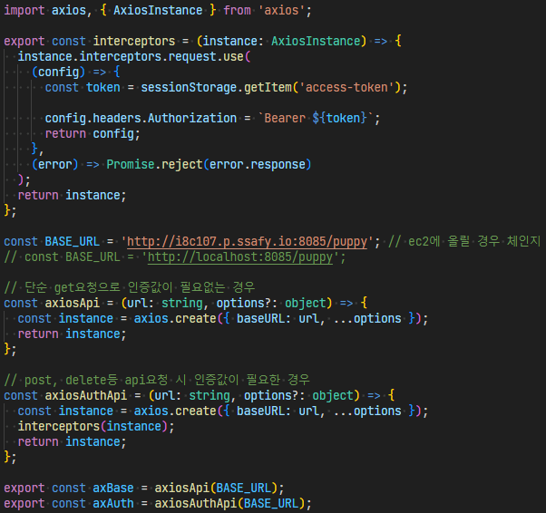
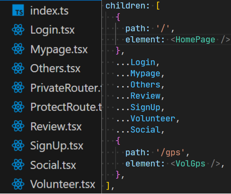

## 주요 기능

- 구글폼, 카카오톡 등으로 이루어지는 **신청 절차를 웹으로** 구현
- 비행기 위치 API를 통해 강아지가 있는 비행기 추적
- **OCR 기능**을 이용한 서류 작성

## 프로젝트 성과

SSAFY 공통 프로젝트 **우수상**

## 스택 선정 이유

- TypeScript: 오타 방지 및 디버깅을 용이하게 하기 위함
- React: 방대한 **라이브러리**를 활용하여 개발 효율 향상하기 위함
- Vite: Esbuild로 미리 번들링한 모듈을 사용해 **dev server**의 빠른 구동을 활용하기 위함
- Tailwind-css: preset 기능을 사용해 **디자인 시스템**을 구축하고, 빠른 CSS 코드를 작성하기 위함
- css-module: Tailwind로 인해 **코드 가독성**이 하락할 때 대체하여 사용하며, class명 충돌을 없애 컴포넌트 단위 개발을 쉽게 하기 위함

## 작업 기여도

1. 목업 및 공통 컴포넌트 제작

- 피그마를 사용해 목업과 프로토타입 제작

2. 프로젝트 FE 개발 환경 구성

- 짧은 프로젝트 개발기간과 다른 팀에 비해 1명이 적은 프론트엔드 팀원 수를 고려하여 **프로젝트에 적합**한 기술 스택 선정
- vite, typescript, react를 바탕으로한 개발 환경 구성

3. 디자인 시스템 설계

- Tailwind CSS를 사용해 색상, 타이포그래피 등을 설정

4. 랜딩페이지 및 봉사관련 페이지 제작

- CSS를 사용해 로딩 컴포넌트 제작

5. axios를 사용한 API 호출

- request 과정에서 instance를 가로채 access-token을 주입함으로써 인증과정 추상화

## 프로젝트 리뷰

- 기획부터 디자인, 개발까지 개발 실력과 **협업 역량**을 기를 수 있었습니다.
- 다른 팀보다 적은 프론트엔드 개발 인력 문제를 **개발 효율의 극대화**로 극복 한 좋은 경험이었습니다.
- 타겟 사용자인 동물단체와 **소통**하였으며, 사용자의 의견을 **기획에 반영**하였습니다.

## 관련 링크

[github](https://github.com/appletail/PuppyLink)
[figma](https://www.figma.com/design/dEp1hJuA7Ge6LZYpCuTpDq/Puppy-Link?node-id=0-1&t=MRs85S5Wb53htO2Z-0)

## 트러블 슈팅

### 1. 이벤트 버블링

  
**[문제점]** 모달 배경이 아닌 모달 컴포넌트를 클릭해도 모달이 종료되는 문제가 있었습니다.

**[해결]** html에서의 이벤트 흐름을 공부했고, **이벤트 버블링**이 원인이라는 것을 알게되었습니다.  
**e.stopPropagation( )** 기능을 사용해 버블링을 막고 문제를 해결했습니다.

### 2. DRY 원칙 준수

  
**[문제점]** axios를 이용한 API 통신마다 baseURL을 작성하고 token을 호출해 가독성이 떨어지는 문제가 있었습니다.

**[해결]** **DRY 원칙**을 준수하기 위해 **Axios Instance**를 만들어 baseURL을 반복 하지 않도록 했습니다.  
또한, **Axios interceptors** 기능을 사용해 request시 통신을 가로채고 token을 주입했습니다.

### 3. log를 사용한 문제 원인 탐색 및 백엔드와의 협업

  
**[문제점]** API 통신중 컴포넌트가 사라지는 문제가 있었습니다.

**[해결]** **git log**를 통해 최근 커밋 내용을 확인 하니 백엔드에서 DB에 **not null 속성의 컬럼**을 추가한 것을 발견했습니다.  
post data에 isActive를 추가한 뒤, 백엔드에 DB 초기화를 요청해 문제를 해결했습니다.

### 4. 관심사 분리를 통한 가독성 향상

  
**[문제점]** router의 페이지가 늘어남에 따라 가독성이 하락하고 원하는 코드를 찾기 어려운 문제가 발생했습니다.

**[해결]** 코드 분리와 스프레드 연산자를 통해 관심사를 분리하고 가독성을 향상하였습니다.
