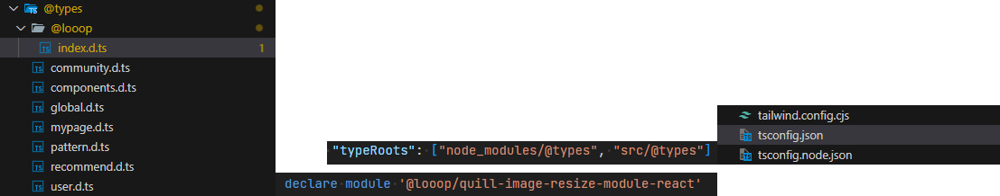
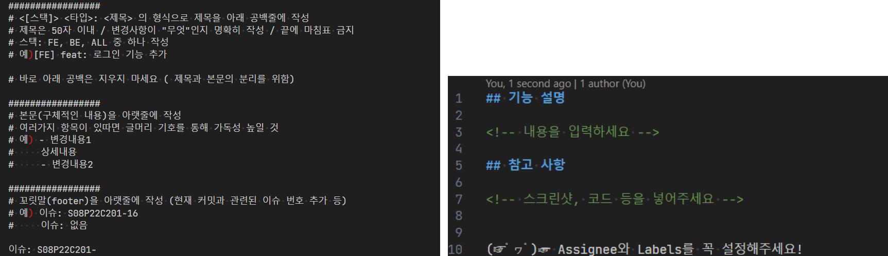
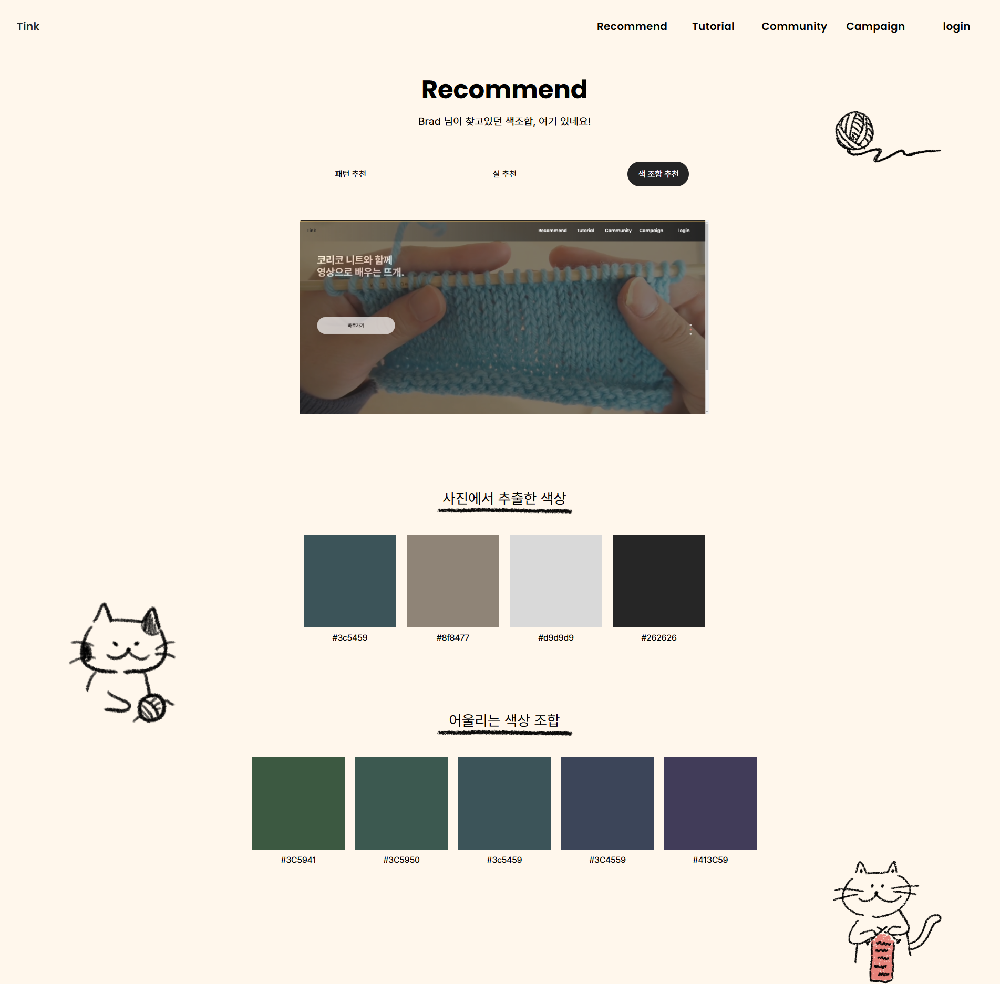
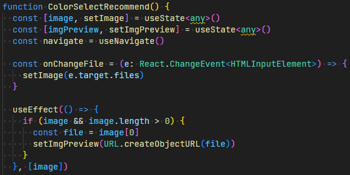

## 주요 기능

- **빅데이터 추천** 기능을 통한 도안 및 실 추천
- 사진 색상 추출을 통한 **색 추천**
- **WYSIWYG** 기능을 이용한 손쉬운 글작성

## 스택 선정 이유

- react-quill: **WYSIWYG** 기능을 사용한 GUI 글작성 구현
- extract-colors: 사진 **색 추출** 기능 구현
- simpler-color: 색상 기준으로 **색 추천** 기능 구현

## 작업 기여도

1. 목업 및 공통 컴포넌트 제작

- 피그마를 사용해 목업 제작

2. 프로젝트 FE 개발환경 구성
3. 색상 추천 기능

- 두 가지 라이브러리를 조합해 [Adobe Color](https://color.adobe.com/ko/create/image)와 같은 기능을 구현

4. WYSIWYG 글작성 기능

- react-quill을 사용해 보이는 그대로 글작성이 가능한 위지윅 방식의 게시글 작성 페이지 구현

5. 문서 템플릿 제작

- 원활한 협업을 위해 commit 메시지 템플릿과 merge request 템플릿을 만들어 공유

## 프로젝트 리뷰

- 원하는 기능의 라이브러리가 없을 경우, 단계를 분리하고 **라이브러리를 조합**해 구현하는 방법을 배웠습니다.
- JavaScript로 만들어진 라이브러리를 TypeScript에 적용하는 방법을 배웠습니다.
- commit 메시지 템플릿과 merge request 템플릿을 만들고 공유하며 **협업의 효율성**을 높이는 방법을 배웠습니다.

## 소스 코드

[github](https://github.com/appletail/Tink)
[figma](https://www.figma.com/design/x50c9FDAEuH6kPKLP9OO85/Tink?node-id=0-1&t=vsXX5meCELJJ9XL3-1)

## 트러블 슈팅

### 1. type이 제공되지 않는 라이브러리

  
**[문제점]** react-quill의 이미지 변환 라이브러리가 **Definitely Typed**을 제공하지 않는 문제가 있었습니다.

**[해결]** 타입이 내장된 라이브러리의 소스 코드에서 **declare**라는 키워드를 확인했습니다. 이를 바탕으로 다음과 같은 방법의 해결책을 찾았습니다.  
내장된 타입 선언이 없을 경우 src/@types에서 타입을 가져올 수 있도록 **tsconfig에 경로**를 추가했습니다.  
그리고 타입스크립트에서 외부 라이브러리를 인식할 수 있도록 **declare module**을 사용해 'quill-image-resize-module-react'를 선언했습니다.

### 2. template을 사용한 협업

  
**[문제점]** commit message와 merge request 컨벤션이 정해져 있었지만, **준수하지 않는 문제**가 있었습니다.

**[해결]** 팀원들에게 질문 결과 **컨벤션을 숙지할 시간이 부족**한 것이 원인이었습니다.  
숙지 여부와 관계없이 컨벤션을 따를 수 있도록 **commit message template**과 **merge request template**을 만들고 공유했습니다.

### 3. 라이브러리 조합을 통한 기능 구현

  
**[문제점]** Adobe Color와 같은 기능을 구현하고 싶었지만 적절한 라이브러리가 없는 상황이었습니다.

**[해결]** 처음부터 구현하기에는 많은 시간이 필요할 것이라 판단했습니다.  
그래서 기능을 더 많은 단계로 나누어 설계한 뒤, 각 **단계별로 다른 라이브러리를 사용**하는 방법을 생각했습니다.

**기존 설계**  
이미지를 넣는다 => 이미지에 맞는 색상을 추천한다.

**수정한 설계**  
이미지를 넣는다 => 이미지에서 가장 많이 사용되는 색상을 추출한다. => 추출한 색을 바탕으로 색을 추천한다.

### 4. 사용자가 업로드한 사진 미리보기

  
**[문제점]** 업로드한 이미지를 서버에 전송하기 전에 사용자에게 미리보기를 제공하고 싶었습니다. 하지만 그 방법을 모르는 문제가 있었습니다.

**[해결]** < input type='file' >을 사용했을떄 사용자의 브라우저 어딘가에 **이미지가 저장될 것**이라고 예상했습니다.  
또한, 이를 다시  태그의 src에 넣을 수 있는 형태로 접근할 수 있을 것이라 생각했습니다.  
해결책을 탐색한 결과 **URL.createObjectURL()** 방법을 찾을 수 있었습니다.  
이를 통해 브라우저 메모리에 사용자가 제출한 이미지를 저장하고 URL을 생성하는 방식으로 문제를 해결했습니다.
