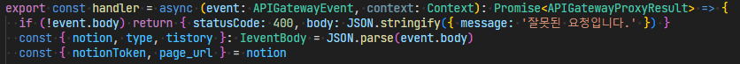

## 주요 기능

- 노션에서 작성한 글을 tistory와 github로 이전
- 크롬 확장프로그램을 이용한 편의성 제공
- 튜토리얼 페이지 지원

## 프로젝트 성과

SSAFY 자율 프로젝트 **우수상**  
VALUE UP 교육생 공모전 **대상**

## 스택 선정 이유

- Styled-component: JS와 CSS 간의 **상수와 함수 공유**
- CRXJS: React를 사용한 **크롬 확장프로그램** 개발
- AWS lambda: **Java Spring**에서 적은 자원으로 **Javascript 라이브러리 호출**을 위함

## 작업 기여도

1. 프로젝트 FE 개발환경 구성

- 프로젝트 개발기간, 각 팀원의 일정, 프론트엔드 팀원 수를 고려하여 **MUI template**을 활용

2. 사이드바, 발행 페이지 제작

- axios interceptor를 활용해 로딩 컴포넌트 제작

3. 크롬 확장프로그램

- CRXJS를 활용해 vite, react 환경에서 제작
- 기존의 API를 이용해 2일이라는 단기간에 제작 완료
- [크롬 웹스토어](https://chromewebstore.google.com/detail/nogari-%EB%85%B8%EC%85%98%EC%97%90%EC%84%9C-%EA%B0%80%EB%8A%94-%EC%9D%B4%EC%95%BC%EA%B8%B0/hjdmhaniikfbncdhikfbgfkpchicegfp?utm_source=ext_app_menu)에 배포 및 **86명의 사용자** 확보

4. 노션 데이터 변환 기능

- notion 데이터를 markdown으로 변환한 뒤 html로 변환하는 방식으로 구현
- markdown은 github로 전송하고 html은 tistory로 전송
- JavaScript로 만들어진 변환기능을 Java 서버에서 불러오기 위해 **AWS lambda** 사용
- [notion-to-md](https://github.com/souvikinator/notion-to-md) 라이브러리에 색상기능을 추가하기위해 **라이브러리 분석 및 수정**

## 프로젝트 리뷰

- OPEN API를 연동할 때 예상치 못한 오류가 많이 발생했습니다. **공식문서**를 꼼꼼히 읽어야한다는 교훈을 얻었습니다.
- 크롬 확장프로그램을 배포하는 경험을 통해 **UX 향상을 위한 방법**이 다양하다는 것을 깨달았습니다.
- 자바스크립트 **라이브러리를 분석**하고 프로젝트에 맞게 수정하며 자바스크립트에 대한 실력을 향상할 수 있었습니다.

## 관련 링크

[github](https://github.com/appletail/Nogari)
[figma](https://www.figma.com/design/kAicnJo6OXkvUTQYkUyY0f/Nogari?node-id=1-2&t=2TxuhPCNJ5gcttWe-1)
[크롬 웹스토어](https://chromewebstore.google.com/detail/nogari-%EB%85%B8%EC%85%98%EC%97%90%EC%84%9C-%EA%B0%80%EB%8A%94-%EC%9D%B4%EC%95%BC%EA%B8%B0/hjdmhaniikfbncdhikfbgfkpchicegfp?utm_source=ext_app_menu)

## 트러블 슈팅

### 1. 크롬 확장프로그램

  
**[문제점]** 사용 방법이 **복잡**하다는 사용자의 피드백을 받았습니다.

**[해결]** 노션에서 URL을 복사한 뒤 노가리 웹사이트에 붙여넣기 하는 과정이 복잡하다고 판단했습니다.  
**노션 페이지 안에서** 원클릭으로 모든 기능이 작동한다면 UX를 향상 할 수 있을 것이라 생각해 **크롬 확장프로그램**을 계획했습니다.  
빠른 개발과 편의를 위해 vite의 플러그인인 **CRXJS**를 사용해 react로 개발했습니다.

### 2. refetchOnWindowFocus: false

  
**[문제점]** 사용자가 작성중인 글이 간헐적으로 사라지는 문제가 있었습니다.

**[해결]** 사용자의 이용동선을 예상해 문제상황을 구현했고, 창을 벗어났을 때 refetch가 발생하는 것을 발견했습니다.  
**react query 공식문서**를 꼼꼼히 읽은 뒤 refetchOnWindowFocus: false를 추가해 문제를 해결했습니다.

### 3. 라이브러리 분석 및 수정

  
**[문제점]** notion-to-md 라이브러리의 경우 글꼴 색상, tistory 이미지 업로드 등의 기능이 없었습니다.

**[해결]** 노션의 글을 tistory에 그대로 옮기는 것이 목표였기에, **라이브러리를 분석**하고 필요한 부분을 **수정**해 사용할 수 있도록했습니다.

- **폴더 및 파일 이름**을 통해 전체적인 구조를 파악했습니다.
- index.ts를 시작으로 **데이터 흐름**을 따라가며 수정이 필요한 부분을 파악했습니다.
- 분석한 것을 바탕으로 이미지 업로드, 글꼴 색상, 수학식 표현 기능 등을 추가했습니다.

### 4. Java 서버에서 JavaScript 변환 기능 호출

  
**[문제점]** 서버는 Java로 이루어진반면 변환기능은 JavaScript로 만들어졌있었기 때문에 호출이 어려운 문제가 있었습니다.

**[해결]** Java Scripting API, node.js 서버 호스팅, AWS lambda 세가지 해결책을 찾았고 **AWS lambda**를 채택했습니다. 판단 기준은 다음과 같았습니다.

- Java Scripting API: 자바 내에서 JavaScript를 직접 구현하는 것은 좋았지만 **러닝커브가 높을 것**으로 판단했습니다.
- node.js 서버 호스팅: 하나의 기능만을 위해 서버를 구현하고 호스팅하는 것은 **실제 금액적인 비용에서 손해**가 있을 것으로 판단했습니다.
- AWS lambda: **낮은 러닝커브**라는 이점과 예상 사용량이 AWS lambda의 **무료 사용량**을 초과하지 않을 것이라는 이점을 고려해 채택했습니다. 물론, 콜드 스타트 지연으로 인해 응답시간이 늦어질 수 있는 문제가 있지만, 기능 자체가 실행에 오랜 시간이 걸리기에 문제 없을 것이라 판단했습니다.
