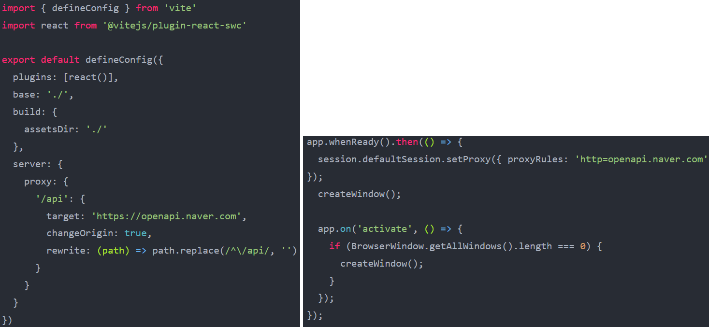

## 주요 기능

- **긴 URL을 짧게 줄여**서 사용자가 눈으로 읽고 쉽게 옮겨 적을 수 있도록 도와줌
- 단축 URL 클릭시 **클립보드에 복사**됨
- qr 코드 클릭시 **png 파일로 다운로드**됨
- 본인의 NAVER Open API key만 입력하면 **자신만의 shortURL 제작** 가능
- 데스크탑 애플리케이션으로 만들어져있어 자신만의 **shortURL을 손쉽게 공유** 가능

## 스택 선정 이유

- Vite: CRA와 달리 필수적인 기능만 들어서 **가볍고**, webpack 보다 **빠른 dev server**를 활용하기 위함
- TypeScript: **손쉬운 디버깅**을 통해 버그를 사전에 방지와 **IDE 자동 리스트업 기능**을 사용하기 위함
- React: NAVER Open API와 **통신하는 기능만 구현**하면 되므로 가장 익숙한 라이브러리를 선택
- electron: 손쉬운 **데스크톱 애플리케이션 생성**과 **효과적인 cors 에러 해결**이 가능해 선택
- axios: fetch보다 **간결하고 직관적인 코드**를 작성할 수 있어 선택

## 작업 기여도

1. 프로젝트 FE 개발환경 구성

- 프로젝트 개발기간, 각 팀원의 일정, 프론트엔드 팀원 수를 고려하여 **MUI template**을 활용

2. 사이드바, 발행 페이지 제작

- axios interceptor를 활용해 로딩 컴포넌트 제작

3. 크롬 확장프로그램

- CRXJS를 활용해 vite, react 환경에서 제작
- 기존의 API를 이용해 2일이라는 단기간에 제작 완료
- [크롬 웹스토어](https://chromewebstore.google.com/detail/nogari-%EB%85%B8%EC%85%98%EC%97%90%EC%84%9C-%EA%B0%80%EB%8A%94-%EC%9D%B4%EC%95%BC%EA%B8%B0/hjdmhaniikfbncdhikfbgfkpchicegfp?utm_source=ext_app_menu)에 배포 및 **86명의 사용자** 확보

4. 노션 데이터 변환 기능

- notion 데이터를 markdown으로 변환한 뒤 html로 변환하는 방식으로 구현
- markdown은 github로 전송하고 html은 tistory로 전송
- JavaScript로 만들어진 변환기능을 Java 서버에서 불러오기 위해 **AWS lambda** 사용
- [notion-to-md](https://github.com/souvikinator/notion-to-md) 라이브러리에 색상기능을 추가하기위해 **라이브러리 분석 및 수정**

## 프로젝트 리뷰

- OPEN API를 연동할 때 예상치 못한 오류가 많이 발생했습니다. **공식문서**를 꼼꼼히 읽어야한다는 교훈을 얻었습니다.
- 크롬 확장프로그램을 배포하는 경험을 통해 **UX 향상을 위한 방법**이 다양하다는 것을 깨달았습니다.
- 자바스크립트 **라이브러리를 분석**하고 프로젝트에 맞게 수정하며 자바스크립트에 대한 실력을 향상할 수 있었습니다.

## 관련 링크

[github](https://github.com/appletail/shortURL-App)

## 트러블 슈팅

### 1. [cors 에러](https://appletail.tistory.com/144)

  
**[문제점]** Open API 서버와의 cors 에러가 발생했습니다.

**[해결]** cors 에러는 동일 출처가 아닐 경우에 발생하는 에러입니다.

- 서버가 존재하지 않기 때문에 **proxy 설정**을 통해 해결을 시도했습니다.
- vite 자체적인 proxy 설정으로 **dev server**에서의 cors 에러를 해결했습니다.

하지만 **build 이후** 다시 한 번 cors 에러가 발생했습니다.

- 원인은 c:/경로/index.html에서 **null/js/module.js로 리소스를 요청**한 것이 됐기 때문이었습니다.

탐색을 통해 **electron**을 사용하면 cors 에러가 없어진다는 것을 알게되었습니다.

- **로컬에서의 사용**을 목표로 했기 때문에 electron으로 만든 데스크탑 애플리케이션이 **프로젝트에 더 적합**하다고 판단했습니다.
- electron의 **proxy 설정**을 통해 cors 에러를 해결했습니다.

### 2. [qr코드 다운로드 기능](https://appletail.tistory.com/146)

  
**[문제점]** API에서 제공하는 QR코드는 .qr 파일이었습니다. 하지만 .png 파일이 더 유용할 것이라 생각해 이를 다운로드하는 기능을 구현하고 싶었습니다.

**[해결]** <a> 태그에 **download라는 속성**을 사용해 다운로드를 구현했습니다.

- download에는 파일 이름을 지정하는 **filename 옵션**이 있습니다.
- 이 옵션을 사용할때 **확장자명을 함께 작성**하면 그 확장자로 다운로드가 가능하다는 것을 알게되었습니다.
- 이 기능을 사용해 **.png 파일 다운로드** 기능을 구현했습니다.
